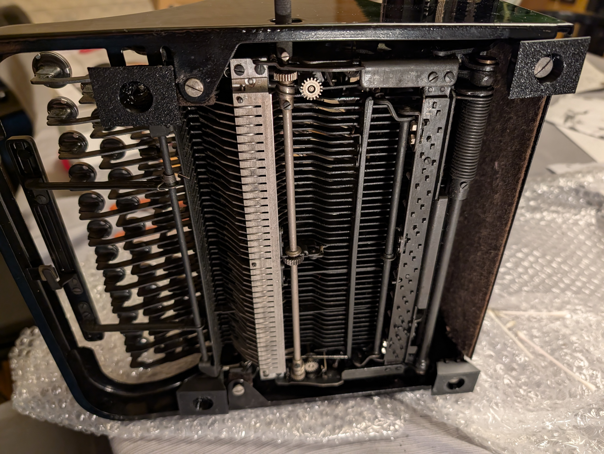
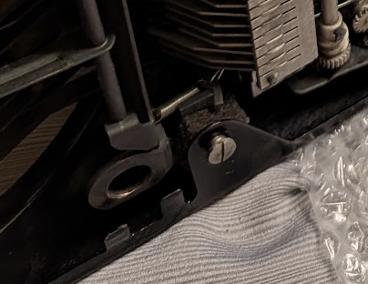
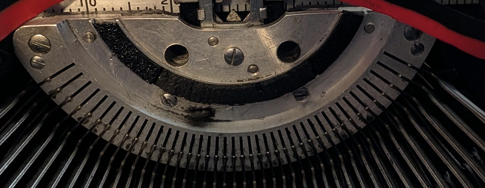

# Underwood Champion Typewriter Rubber Parts

Replacement parts for a 1938 Underwood Champion portable typewriter:
Replacement feet (front and back), and the bumper on the segment.

## Contents

The back feet mount with a screw through them:

*   `underwood_foot_back.scad`: OpenSCAD source file for the back feet.
*   `underwood_foot_back.stl`: Exported STL file for the back feet.

The front feet have a press-fit peg that goes into a circular bracket on the underside of the typewriter:

*   `underwood_foot_front.scad`: OpenSCAD source file for the front feet.
*   `underwood_foot_front.stl`: Exported STL file for the front feet.

*   `segment_bumper.scad` and `segment_bumper.stl`: The circular arc-shaped segment bumper.

The segment bumper isn't sized exactly. When I repaired my typewriter, I used it to
patch missing parts, so I just cut sub-segments out of it with diagonal clippers
and pushed them in place. I printed mine with sparse infill but it would probably be
nicer with 100% infill.

## Usage

Print the `.stl` files using some form of medium density TPU. I used 95A.

## Future suggestions

The feet would be nicer if the edges were a little rounded.

## License

Apache License, Version 2.0; see LICENSE file for details.
